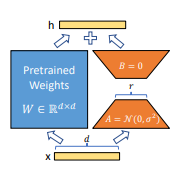

# PDF Q&A 데이터를 활용한 LLM 파인튜닝 가이드

이 가이드는 PDF에서 추출한 질문-답변 데이터를 사용하여 대규모 언어 모델(LLM)을 효율적으로 파인튜닝하는 방법을 설명합니다. 저비용 고효율의 파인튜닝을 위해 LoRA 어댑터와 Unsloth 최적화 기술을 활용합니다.

## 📋 목차

1. 환경 준비
2. 데이터 준비
3. LoRA와 Unsloth
4. 모델 파인튜닝
5. 추론 및 평가

## 1. 환경 준비

### 필수 라이브러리

파인튜닝에 필요한 주요 라이브러리:
- `torch`: 딥러닝 프레임워크
- `unsloth`: LLM 최적화 라이브러리
- `transformers`: 모델 및 토크나이저 로드
- `datasets`: 데이터셋 처리
- `trl`: 지도 학습 파인튜닝(SFTTrainer)

> ⚠️ **중요**: `trl` 패키지는 파인튜닝을 위한 필수 라이브러리입니다. SFTTrainer 클래스가 이 패키지에 포함되어 있으며, 이 없이는 지도 파인튜닝(Supervised Fine-Tuning)을 수행할 수 없습니다.

### GPU 호환성 확인

```python
import torch
major_version, minor_version = torch.cuda.get_device_capability()
```

NVIDIA GPU에 따라 다양한 메모리 최적화 기법을 적용할 수 있습니다:
- Ampere 아키텍처(A100, A10G 등): BFloat16 지원
- Tesla/Turing 아키텍처(T4, V100): Float16 권장

> 💡 **참고**: PyTorch 버전에 따라 패치가 필요할 수 있습니다. PyTorch 2.3 미만 버전에서는 `torch.amp.is_autocast_available()` API 패치가 필요합니다.

## 2. 데이터 준비

### Q&A 데이터 구조

PDF QA 추출 도구로 생성된 JSONL 파일은 다음과 같은 구조를 가집니다:

```json
{
  "instruction": "금융보안교육센터의 주소는 어디인가요?",
  "output": "금융보안교육센터의 주소는 서울특별시 영등포구 의사당대로 143 금융투자빌딩 12층입니다."
}
```

### 학습 데이터 포맷팅

LLM 파인튜닝을 위해 데이터를 적절한 프롬프트 형식으로 변환해야 합니다. 일반적으로 "지시사항-응답" 형태의 템플릿을 사용하며, 각 예제의 끝에는 종료 토큰(EOS)을 추가합니다.

## 3. LoRA와 Unsloth

### LoRA(Low-Rank Adaptation) 이해하기

LoRA는 대규모 언어 모델(LLM)을 효율적으로 파인튜닝하기 위한 기술입니다:


*참조: Hu, E., Shen, Y., Wallis, P., Allen-Zhu, Z., Li, Y., Wang, S., Wang, L., & Chen, W. (2022). LORA: LOW-RANK ADAPTATION OF LARGE LANGUAGE MODELS. arXiv.*

**주요 특징:**
- **효율성**: 전체 모델 파라미터의 약 1~10%만 학습
- **원리**: 가중치 행렬 변화를 저차원(low-rank) 행렬의 곱으로 근사
- **파라미터**:
  - `r`: 랭크 크기 (클수록 표현력 ↑, 학습 파라미터 ↑)
  - `alpha`: 스케일링 파라미터 (보통 r의 2배 설정)
  - `target_modules`: 적용할 모듈 (어텐션, FF 레이어 등)

### Unsloth 최적화 기술

Unsloth는 LLM 훈련 효율성을 극대화하는 최적화 라이브러리입니다:

**핵심 기능:**
- **컴퓨팅 최적화**: CUDA 커널 및 주의 메커니즘 최적화
- **그래디언트 체크포인팅**: "unsloth" 모드로 VRAM 30% 추가 절약
- **추론 가속**: FastLanguageModel.for_inference() 메소드로 생성 속도 2배 향상

**정밀도 선택 옵션:**
- **4비트 양자화** (`load_in_4bit=True`)
  - 가장 메모리 효율적인 옵션으로 VRAM 사용량 80% 감소
  - 최소한의 VRAM으로 큰 모델 훈련 가능
  - 약간의 정확도 손실 가능성 있음

- **8비트 양자화** (`load_in_8bit=True`)
  - 4비트보다 정확도가 더 좋음
  - 그러나 더 많은 메모리 필요
  - 정확도와 메모리 사용량의 균형점

- **16비트 정밀도** (`dtype=torch.float16` 또는 `torch.bfloat16`)
  - 가장 높은 정확도
  - 가장 많은 메모리 사용
  - bfloat16은 Ampere+ GPU에서 권장 (A100, A10G, A5000 등)
  - float16은 Tesla/Turing GPU에서 권장 (T4, V100)

- **자동 감지** (`dtype=None`)
  - GPU 타입에 따라 적절한 정밀도 자동 선택

**적용 시 이점:**
- 일반 LoRA보다 2-3배 빠른 학습 속도
- 8GB VRAM으로도 7B 모델 파인튜닝 가능
- 동일 하드웨어에서 더 큰 배치 크기 사용 가능

## 4. 모델 파인튜닝

### 파인튜닝 주요 단계

1. **모델 로드**: 적절한 정밀도 옵션으로 기본 모델과 토크나이저를 로드합니다.

2. **LoRA 어댑터 설정**: 어댑터의 랭크, 타겟 모듈, 드롭아웃 등을 설정합니다.

3. **SFTTrainer 구성**: 학습률, 배치 크기, 에폭, 메모리 최적화 옵션 등의 훈련 파라미터를 설정합니다.

4. **모델 훈련 및 저장**: 준비된 설정으로 모델을 훈련하고 결과를 저장합니다.

```python
# 모델 로드 시 정밀도 옵션 예시
model, tokenizer = FastLanguageModel.from_pretrained(
    model_name="beomi/Llama-3-Open-Ko-8B-Instruct-preview",
    max_seq_length=4096,
    
    # 아래 정밀도 옵션 중 하나 선택
    load_in_4bit=True,                # 4비트 양자화 (최소 VRAM)
    # load_in_8bit=True,              # 8비트 양자화 (중간 VRAM)
    # dtype=torch.float16,            # Float16 정밀도 (T4/V100)
    # dtype=torch.bfloat16,           # BFloat16 정밀도 (A100/A10G)
    # dtype=None,                     # 자동 감지
)

model = FastLanguageModel.get_peft_model(
    model,
    r=16,                             # LoRA 랭크
    use_gradient_checkpointing="unsloth"  # 메모리 최적화
)
```

### 권장 파라미터 설정

| 파라미터 | 권장 값 | 설명 |
|----------|---------|------|
| r | 8~64 | 작을수록 메모리 효율적, 클수록 성능 향상 |
| lora_alpha | 2r | 일반적으로 랭크의 2배로 설정 |
| learning_rate | 2e-4~1e-5 | 큰 값은 빠른 학습, 작은 값은 안정적 학습 |
| batch_size | 1~8 | VRAM에 맞게 조정 (gradient_accumulation_steps와 함께) |

## 5. 추론 및 평가

### 모델 추론 최적화

Unsloth는 추론 속도도 최적화합니다:

```python
# 추론 가속화
FastLanguageModel.for_inference(model)
```

이 설정으로 토큰 생성 속도가 약 2배 향상됩니다.

### 실제 사용 예시

파인튜닝된 모델은 템플릿 형식에 맞춰 질문을 제공하면 학습된 지식을 기반으로 응답을 생성합니다. 예를 들어 "금융보안교육센터의 주소?"라는 질문을 입력하면, PDF에서 추출된 정보를 바탕으로 정확한 주소를 응답할 수 있습니다.

## 💡 최적화 전략 및 고급 팁

### GPU 메모리 최적화

- **정밀도 선택**: 하드웨어와 요구사항에 따라 적절한 정밀도 선택
  - 제한된 VRAM (8-12GB): 4비트 양자화 사용
  - 중간 VRAM (16-24GB): 8비트 양자화 고려
  - 충분한 VRAM (32GB+): 16비트 정밀도로 최상의 성능 확보
- **gradient_checkpointing**: 활성화 시 30% 추가 VRAM 절약
- **batch_size와 gradient_accumulation_steps**: 곱이 같으면 동일한 효과, 나눠서 메모리 조절

### 모델 선택 전략

- **소형 모델(~7B)**: 리소스 제약 환경에 적합, 빠른 반복 가능
- **한국어 특화 모델**: Llama-3-Open-Ko-8B 등 한국어 처리에 강점
- **특정 도메인 모델**: 금융, 법률 등 특정 분야에 사전 학습된 모델 선택

### 향후 데이터 품질 향상 방법

- **PDF QA 추출 파라미터 조정**: 추출 품질 향상으로 학습 데이터 품질 개선
- **역전파 학습(Backtranlation)**: 동일 개념에 대한 다양한 표현 생성으로 데이터 증강
- **데이터 필터링**: 중복, 불명확한 QA 쌍 제거로 품질 향상


## 💡 주요 요점

- **메모리 효율성**: N비트 양자화와 LoRA 어댑터로 메모리 사용량 최소화
- **빠른 훈련 속도**: Unsloth 최적화를 통해 기존 대비 2배 이상 빠른 훈련 속도
- **한국어 특화**: 한국어 기반 모델을 사용하여 우수한 응답 품질
- **간편한 구현**: 전체 파이프라인이 명확하게 정의되어 쉽게 구현 가능

## 🔍 주의사항

1. **trl 패키지 필수**: SFTTrainer를 사용하기 위해 trl 패키지가 반드시 설치되어야 합니다. 없으면 파인튜닝 과정이 작동하지 않습니다.
2. **GPU 요구사항**: 최소 12GB VRAM이 권장됩니다. 더 작은 GPU에서는 batch size 조정이 필요합니다.
3. **데이터 품질**: 파인튜닝 결과는 데이터 품질에 크게 의존합니다. 고품질 Q&A 데이터를 준비하세요.
---

이 가이드를 통해 PDF에서 추출한 Q&A 데이터로 효율적인 LLM 파인튜닝을 수행할 수 있습니다. LoRA 어댑터와 Unsloth 최적화를 결합하면 제한된 컴퓨팅 자원으로도 특정 도메인에 최적화된 고성능 모델을 구축할 수 있습니다. 정밀도 옵션을 적절히 선택하여 사용 가능한 하드웨어 자원과 모델 성능 간의 최적의 균형을 찾을 수 있습니다.