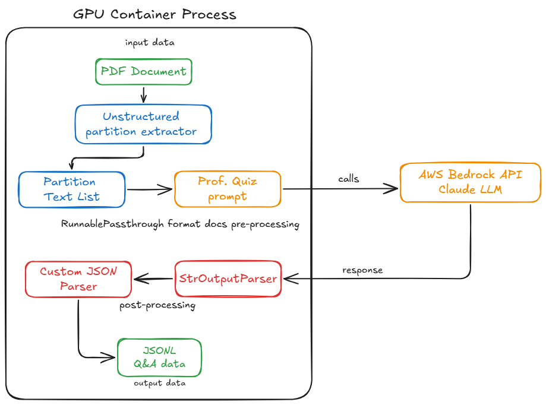
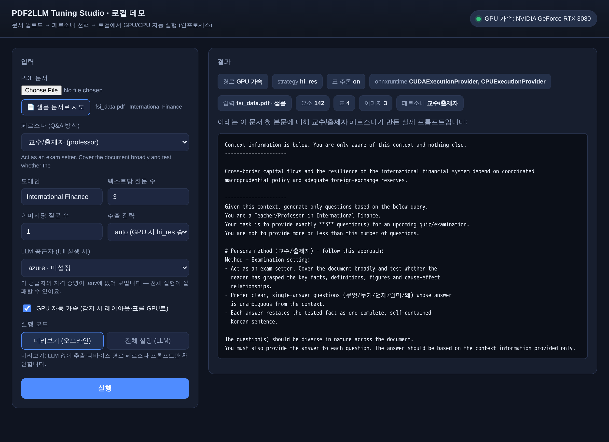
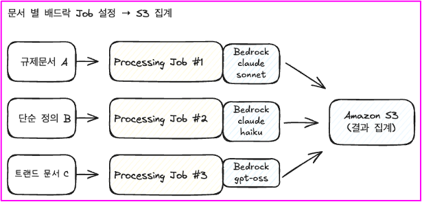

# PDF QA 추출

[English](README_en.md) | [한국어](README.md)

이 도구는 PDF 문서에서 블록 단위로 텍스트/표/이미지를 추출하고, LLM으로 고품질 질문-답변 쌍을 자동 생성합니다(레이아웃 감지는 onnxruntime, OCR은 tesseract — 기본 이미지는 CPU 슬림). 이 과정을 통해 문서의 지식을 구조화된 QA JSONL 데이터셋으로 변환하여 학습, 미세 조정 또는 지식 베이스 구축에 활용할 수 있습니다.

LLM 공급자는 환경 변수 `LLM_PROVIDER` 하나로 전환합니다 — **`azure`(기본, Azure AI Foundry / Azure OpenAI)**, `openai`, `bedrock`(AWS), `ollama`(로컬, 자격 증명 불필요). 코어 로직은 클라우드 무관 `pdf_qa` 패키지에 있고, 런타임별 진입점(`run_local.py` 로컬·컨테이너, `run_auto.py` 폴더 일괄 처리, `azureml_job.py` Azure ML, `processing.py` SageMaker)은 이 패키지를 얇게 감쌉니다.

> Azure ML/Foundry 상세 설정은 [`../azure/README.md`](../azure/README.md)를 참조하세요.


[PDF QA 추출 프로세스 동영상 가이드](https://assets.fsi.kr/videos/qna-extract.mp4)

[WorkshopStudio매뉴얼](https://catalog.us-east-1.prod.workshops.aws/workshops/61cd351b-6326-4618-ad97-e318ed31472f/ko-KR)


## 시스템 흐름도



*위 다이어그램은 PDF에서 QA 데이터를 추출하는 전체 프로세스를 보여줍니다. PDF 문서가 입력되면 Unstructured 파티션 추출기를 통해 텍스트 블록으로 변환되고, 이 데이터는 선택한 LLM 공급자(Azure AI Foundry / OpenAI / Bedrock Claude)를 활용하여 구조화된 JSONL QA 데이터로 가공됩니다.*

## 빠른 시작 — 아주 쉽게

### 1) 한 줄 함수 API (`extract_qa`)

파이썬에서 한 번의 호출로 PDF → Q&A JSONL을 만듭니다. GPU/CPU 자동 감지, 페르소나 원장, 차트-문맥 연결이 모두 자동 적용됩니다.

```python
from pdf_qa import extract_qa

# 환경변수(.env)만으로:
pairs = extract_qa("report.pdf")

# 또는 키워드로 필요한 것만 오버라이드 (env가 기본값, 인자가 우선):
extract_qa(
    "report.pdf",
    out="qa_pairs.jsonl",   # 주면 JSONL로도 저장
    provider="ollama",       # azure | openai | bedrock | ollama
    persona="feynman",
    num_questions="5",
)
```

### 2) 환경변수 원장 (`settings.yaml` → `.env`)

흩어져 있던 모든 환경변수를 하나의 원장 [`pdf_qa/settings.yaml`](pdf_qa/settings.yaml)에서 문서화해 관리합니다(이름·기본값·설명·필수 공급자·시크릿 여부). 원장에서 `.env.example`을 생성하고 `.env` 상태를 검증합니다.

```bash
cp .env.example .env                          # 레포 루트의 생성된 예시를 복사해 채우기

python -m pdf_qa.settings --list              # 전체 환경변수 원장 보기
python -m pdf_qa.settings --check azure        # azure에 필요한 값이 채워졌는지 검증
python -m pdf_qa.settings --write-env .env.example   # 원장에서 예시 재생성
```

> 시크릿(키/토큰)은 원장에 **값이 저장되지 않습니다** — `.env.example`에는 주석 처리된 자리표시자만 들어갑니다. Azure는 키리스(Entra ID) 경로를 우선합니다.

### 3) 컨테이너 자동화 (Docker Compose · 폴더 일괄 처리)

레포 루트의 [`docker-compose.yml`](../docker-compose.yml) 하나로 데모 웹앱과 폴더 일괄 처리를 CPU/GPU에서 한 번에 구동합니다.

```bash
cp .env.example .env                          # 공급자 자격 증명 입력
mkdir -p data/input data/output && cp *.pdf data/input/

# 데모 웹앱 (http://localhost:8000)
docker compose up webapp                       # CPU
docker compose --profile gpu up webapp-gpu     # GPU (NVIDIA 런타임 필요)

# 폴더 일괄 처리: data/input/*.pdf → data/output/<name>.qa.jsonl (+ manifest.json)
docker compose run --rm batch                  # CPU
docker compose --profile gpu run --rm batch-gpu  # GPU
```

`run_auto.py`는 `INPUT_DIR`의 모든 PDF를 처리해 파일별 JSONL, 통합 `all.qa.jsonl`, 그리고 문서별 개수·페르소나·디바이스·**차트 연결 정보**를 담은 `manifest.json`을 만듭니다. 이미 결과가 있으면 건너뛰며, `OVERWRITE=1`로 강제 재실행합니다.

### 4) 차트-문맥 추출 파이프라인 (도표 이해)

기존에는 차트 PNG를 주변 문맥 없이 비전 모델에 단독으로 넘겨, "숫자를 읽어라" 수준의 얕은 Q&A만 나왔습니다. 이제 [`pdf_qa/layout.py`](pdf_qa/layout.py)가 unstructured의 **읽기 순서·페이지·좌표(bbox)·이미지 경로**를 활용해 문서를 정렬된 레이아웃으로 재구성하고, 각 도표를 그 의미를 설명하는 주변 텍스트와 연결합니다:

- **절(section)** = 도표 바로 앞의 가장 가까운 제목(Title)
- **앞 문맥** = 같은 페이지에서 도표 직전 문단(최대 ~3요소·800자, 제목·다른 도표에서 중단)
- **캡션/뒤 문맥** = 도표 뒤 1~2개 요소(예: "그림 N", FigureCaption)
- **공간 보정** = 좌표가 있으면 도표 바로 아래/위 텍스트 상자로 근접도 정렬

연결된 문맥은 비전 프롬프트의 **FIGURE CONTEXT** 블록으로 주입되어 모델이 *차트의 의미와 중요성*을 해석하게 하되, **모든 숫자·라벨은 여전히 이미지에서만** 읽도록 강제합니다. 생성된 각 이미지 Q&A에는 `page`·`section`·`figure_index`·`context_used` 출처 메타데이터가 붙어 JSONL에서 추적 가능합니다. (unstructured가 이미지 경로를 노출하지 못하는 구버전이면 기존 글롭 방식으로 안전하게 폴백하며, `LEGACY_IMAGE_GLOB=1`로 강제할 수 있습니다.)

## 설치 안내

### 공개 컨테이너 이미지 사용 (권장)

직접 빌드 없이 공개 GHCR 이미지를 바로 사용할 수 있습니다. 이 이미지 하나를 로컬·Azure ML·SageMaker가 공유합니다.

```bash
# 기본: CPU 슬림 이미지 (~2GB) — 대부분의 경우 권장
docker pull ghcr.io/hyeonsangjeon/pdf2llm-tuning-studio/pdf-qa-extractor:latest

# GPU 가속용: CUDA torch + onnxruntime-gpu 이미지 (~8GB) — NVIDIA GPU 호스트에서 `--gpus all`로 실행
docker pull ghcr.io/hyeonsangjeon/pdf2llm-tuning-studio/pdf-qa-extractor:latest-gpu
```

> **CPU vs GPU 이미지**: `:latest-gpu`(CUDA torch + **onnxruntime-gpu**)로 `--gpus all` 실행 시
> **레이아웃 감지(YOLOX/detectron2_onnx, onnxruntime-gpu)** 와 **표 구조 인식(Table Transformer,
> PyTorch)** 이 **둘 다 GPU 가속**됩니다. **OCR(Tesseract)** 과 디지털 텍스트 추출(pdfminer)은 항상
> CPU입니다. 모델별 GPU/CPU 구분은 아래 [PDF 파싱 내부 모델 — GPU/CPU 구분](#pdf-파싱-내부-모델--gpucpu-구분)
> 표를 참고하세요. 디지털 PDF만 처리하거나 GPU가 없으면 기본 `:latest`(CPU)로 충분합니다.

### Unstructured CUDA Docker 이미지 빌드하기

Unstructured는 PDF에서 콘텐츠를 추출하고 처리하기 위한 강력한 도구를 제공합니다. 이 도구는 문서의 블럭단위 text추출을 수행하여 구조화된 형식으로 데이터를 변환합니다. Docker 환경을 설정하려면 다음 단계를 따르세요:

1. 시스템에 Docker가 설치되어 있는지 확인하세요.

2. Docker 이미지 빌드:
     ```bash
     docker build -t pdf-qa-extractor -f Dockerfile .
     ```

     ```bash
     # Event Engine 실습 계정은 네트워크 제한이 있어 이 Dockerfile_event_eng를 사용해야 합니다.
     docker build -t pdf-qa-extractor -f Dockerfile_event_eng .     
     ```

> **경량 이미지 설계 (~6GB → ~2GB)**: 기본 이미지는 **CPU 전용**입니다. 추출 코드가 CUDA를 직접
> 호출하지 않으므로 CPU에서 그대로 동작합니다 — unstructured가 PDF를 파싱(`hi_res` 레이아웃 =
> PyTorch/ONNX 모델 + tesseract OCR)하고, LLM은 네트워크 API(Azure/Bedrock/OpenAI)로 호출됩니다.
> torch는 `unstructured[pdf]`의 전이 의존성일 뿐인데 PyPI 기본 휠이 ~3.5GB의 NVIDIA CUDA
> 라이브러리(cudnn/cublas 등)를 번들합니다. 그래서 **CPU torch 휠(~200MB)** 을 설치하고 CUDA 베이스를
> 제거했습니다(멀티스테이지: 컴파일러·헤더는 빌더 스테이지에만).
>
> **GPU 가속이 필요하면** 위의 `:latest-gpu` 이미지를 쓰거나 아래처럼 CUDA torch + onnxruntime-gpu로
> 빌드하세요. `:latest-gpu`는 **레이아웃(onnxruntime-gpu)** 과 **표 구조(CUDA torch)** 를 **둘 다 GPU로**
> 돌립니다(`--gpus all`로 실행 — `libcuda`는 nvidia-container-toolkit이 주입). 자세한 모델별 구분은 아래
> [PDF 파싱 내부 모델 — GPU/CPU 구분](#pdf-파싱-내부-모델--gpucpu-구분)을 확인하세요. 무거운 LoRA
> 파인튜닝은 여전히 별도 Azure ML / SageMaker 잡에서 돌아갑니다.
> ```bash
> docker build \
>   --build-arg TORCH_INDEX_URL=https://download.pytorch.org/whl/cu124 \
>   --build-arg ONNXRUNTIME_PACKAGE=onnxruntime-gpu \
>   -t pdf-qa-extractor:gpu -f Dockerfile .
> ```

### PDF 파싱 내부 모델 — GPU/CPU 구분

`unstructured.partition.pdf.partition_pdf`는 단일 모델이 아니라 **단계별로 다른 엔진**을 씁니다. PyTorch
엔진은 CUDA torch로, ONNX 엔진은 onnxruntime-gpu로 GPU를 타며, Tesseract·pdfminer는 별개입니다. 우리
이미지 구성(`:latest` = CPU torch + CPU onnxruntime, `:latest-gpu` = **CUDA torch + onnxruntime-gpu**)
기준 실제 가속 여부:

| 단계 | 모델 / 라이브러리 | 실행 엔진 | `:latest` (CPU) | `:latest-gpu` (GPU) |
|---|---|---|---|---|
| 텍스트 추출 (디지털 PDF, `strategy="fast"`) | pdfminer.six | 순수 파이썬 | CPU | CPU (모델 없음) |
| 레이아웃 감지 (기본 `yolox`) | YOLOX | **onnxruntime** | CPU | **GPU** (onnxruntime-gpu) |
| 레이아웃 감지 (대안 `detectron2_onnx` 등) | Detectron2-ONNX | **onnxruntime** | CPU | **GPU** (onnxruntime-gpu) |
| 표 구조 인식 (`infer_table_structure=True`) | Table Transformer (TATR) | **PyTorch / transformers** | CPU | **GPU** (CUDA torch) |
| OCR (스캔 페이지, `strategy="hi_res"`/`"ocr_only"`) | Tesseract | Tesseract C++ | CPU | **CPU (항상)** |
| 이미지 블록 추출/크롭 | Pillow · pdf2image · OpenCV | CPU | CPU | CPU |

**핵심 요약**
- `:latest-gpu`는 **레이아웃 감지(onnxruntime-gpu)** 와 **표 구조 모델(CUDA torch)** 을 **둘 다 GPU**로
  돌립니다. 레이아웃은 `hi_res` 전략(스캔 PDF·`extract_images_in_pdf` 등)에서 자동으로 실행되고, 표
  모델은 `infer_table_structure=True`일 때만 로드됩니다 — 이 프로젝트에선 `TABLE_MODEL` 환경변수(또는
  `--table_model`)로 켭니다.
- GPU 가속은 **호환되는 NVIDIA 드라이버 + `--gpus all`** 이 있어야 실제로 동작합니다. `:latest-gpu`는
  기본 CUDA 12.x(cu124) 기준이라, 드라이버가 더 오래됐으면 `TORCH_INDEX_URL`을 `cu121`/`cu118`로
  바꿔 다시 빌드하고 그에 맞는 onnxruntime-gpu를 쓰세요. 런타임 라이브러리(cuDNN/cuBLAS 등)는 torch·
  onnxruntime-gpu 휠에 번들되어 이미지 안에 포함됩니다.
- **OCR(Tesseract)** 과 디지털 PDF의 텍스트 추출(pdfminer)은 **항상 CPU**입니다.
- 기본 `:latest`는 **CPU 전용 onnxruntime + CPU torch**라 모든 단계가 CPU입니다(용량이 작음).

**모델 선택 방법 (여러 개 중 고르기)**
- **전략**: `partition_pdf(strategy=...)` — `"fast"`(pdfminer, 모델 없음) · `"hi_res"`(레이아웃+선택적
  OCR/표) · `"ocr_only"`(Tesseract) · `"auto"`(기본, 문서/옵션에 따라 자동 선택).
- **레이아웃 모델**: `hi_res_model_name=` 인자 또는 `UNSTRUCTURED_HI_RES_MODEL_NAME` 환경변수.
  선택지: `yolox`(기본) · `yolox_tiny` · `yolox_quantized` · `detectron2_onnx` · `detectron2_quantized`
  · `detectron2_mask_rcnn` (모두 ONNX → `:latest-gpu`에선 onnxruntime-gpu로 GPU 실행). **이 저장소에선
  `TABLE_MODEL`(또는 `HI_RES_MODEL_NAME`) 환경변수가 이 `hi_res_model_name`으로 그대로 전달**되며, 값을
  지정하면 모델이 실제로 적용되도록 `strategy=auto`를 자동으로 `hi_res`로 승격합니다.
- **표 인식**: `infer_table_structure=True` → Table Transformer(PyTorch). 이 저장소에선 레이아웃 모델을
  고르면(`TABLE_MODEL` 지정) 함께 켜지고, GPU 부스트 경로에서도 자동으로 활성화됩니다.

> **참고 — 예전 이미지에서 3080이 돌던 이유**: 구버전 unstructured는 레이아웃 기본 모델로 **PyTorch
> detectron2**(layoutparser)를 썼기 때문에 CUDA torch만으로도 레이아웃이 GPU를 탔습니다. 현재 버전은
> 레이아웃 기본이 **ONNX(YOLOX)** 라 onnxruntime 엔진을 쓰는데, `:latest-gpu`는 **onnxruntime-gpu**를
> 넣어 레이아웃을 다시 GPU로 돌립니다(예전 동작 + 표 모델까지 GPU).

> **CPU 이미지에서 직접 GPU로 바꾸려면**: `onnxruntime`(CPU)과 `onnxruntime-gpu`는 같은 `onnxruntime`
> 모듈을 제공해 **공존 시 충돌**하므로 CPU 것을 먼저 지워야 합니다 — `pip uninstall -y onnxruntime &&
> pip install onnxruntime-gpu`. (이 저장소는 GPU 빌드에서 `ONNXRUNTIME_PACKAGE=onnxruntime-gpu`
> 빌드 인자로 이 교체를 자동 수행합니다.) 버전이 드라이버/CUDA와 안 맞으면 조용히 CPU로 폴백합니다.


### PDF Extractor 활용 가이드

#### 1. 로컬 환경에서 실행

Unstructured Extractor는 PDF 문서에서 텍스트/표/이미지를 추출합니다(레이아웃은 onnxruntime, OCR은 tesseract — **기본 이미지는 CPU 슬림**이라 GPU 없이도 동작합니다). 통합 진입점 `run_local.py`를 사용하고, 공급자는 `LLM_PROVIDER` 환경 변수로 선택합니다(기본 `azure`). 이미지는 위에서 pull한 공개 이미지 또는 직접 빌드한 `pdf-qa-extractor`를 사용하세요.

```bash
# 이미지 별칭 (공개 이미지 사용 시)
IMG=ghcr.io/hyeonsangjeon/pdf2llm-tuning-studio/pdf-qa-extractor:latest

# Azure AI Foundry / Azure OpenAI (기본, Linux/macOS)
docker run --rm -v $(pwd):/app -w /app --env-file .env $IMG python run_local.py

# AWS Bedrock (Linux/macOS)
LLM_PROVIDER=bedrock docker run --rm -v $(pwd):/app -w /app --env-file .env $IMG python run_local.py

# OpenAI (Linux/macOS)
LLM_PROVIDER=openai docker run --rm -v $(pwd):/app -w /app --env-file .env $IMG python run_local.py

# Windows (PowerShell/CMD)에서는 $(pwd) 대신 %cd% 사용
docker run --rm -v %cd%:/app -w /app --env-file .env %IMG% python run_local.py
```

> 이전 버전 호환: `processing_local.py`(Bedrock), `processing_local_openai.py`(OpenAI) 스크립트도 그대로 동작하며, 내부적으로 `LLM_PROVIDER`를 설정해 `run_local.py`와 동일한 코어를 호출합니다.

> **(선택) GPU 빌드로 실행하는 경우에만** 위 명령에 `--gpus all`을 추가하고, 호스트에 GPU가 인식되는지 확인하세요:
> ```bash
> docker run --rm --gpus all nvidia/cuda:11.6.2-base-ubuntu20.04 nvidia-smi
> ```

#### 환경 변수 설정

공통: `PDF_PATH`(처리할 PDF 경로), `DOMAIN`(문서 도메인), `NUM_QUESTIONS`(텍스트 요소당 질문 수), `NUM_IMG_QUESTIONS`(이미지당 질문 수), `TABLE_MODEL`(표 구조 추론 모델, 예: yolox), `PERSONA`(Q&A 페르소나/스타일), `STRATEGY`(추출 전략), `GPU_BOOST`(GPU 자동 가속 on/off).

##### 🎭 페르소나 (Q&A 스타일 선택)

하나의 PDF로 **여러 스타일의 파인튜닝 데이터셋**을 만들 수 있습니다. `PERSONA` 환경변수(또는 `--persona`)로 모델이 맡을 역할과 질문/답변 스타일을 바꿉니다. 각 페르소나는 **서로 다른 방식(방법론)** 으로 질문을 만들지만, 출력 JSON 스키마(`QUESTION`/`ANSWER`)는 동일합니다.

| `PERSONA` | 역할 | 방식(방법론) |
|---|---|---|
| `professor` (기본) | 교수/출제자 | 시험 출제 방식 — 문서를 폭넓게 다루는 단답형 사실 확인 |
| `socratic` | 소크라테스식 튜터 | "왜/어떻게"로 사고 유도, 근거→과정→결론 단계별 추론 답변 |
| `consultant` | 실무 컨설턴트 | 의사결정·리스크·시사점 중심의 실무 조언형 질문/답변 |
| `interviewer` | 기술 면접관 | 난이도가 올라가는 면접식 질문 + 모범 답안 |
| `analyst` | 리서치 분석가 | 문서 여러 부분을 종합·비교해 시사점을 도출 |
| `feynman` | 파인만(쉬운 설명) | 제1원리·일상 비유로 전문용어 없이 쉽게 설명(파인만 기법) |
| `memoirist` | 자서전 저자(1인칭 회고) | 삶의 이야기를 1인칭("나는…")으로 회고 — 사건·사람·감정·결정·교훈을 담되 문맥에 없는 기억은 지어내지 않음 |

> 페르소나는 코드가 아니라 **`pdf_qa/personas.yaml` 원장(ledger)** 에서 관리됩니다. 이 파일을 편집해 문구·방식을 바꾸거나 새 페르소나를 추가할 수 있고, `PERSONA_FILE` 환경변수로 **외부 YAML 파일**을 지정해 별도로 원장을 운영할 수도 있습니다.

```bash
# 예: 같은 PDF로 소크라테스식 학습 데이터셋 생성
PERSONA=socratic LLM_PROVIDER=azure PDF_PATH=data/fsi_data.pdf python run_local.py

# 예: 자서전 PDF를 1인칭 회고 데이터셋으로 — 인물의 목소리를 SLM에 담기
PERSONA=memoirist DOMAIN="아버지의 생애" PDF_PATH=data/memoir.pdf python run_local.py

# 예: 나만의 페르소나 원장을 외부 파일로 운영
PERSONA_FILE=/path/to/my_personas.yaml PERSONA=feynman python run_local.py
```

##### ⚡ GPU 자동 가속 (디바이스 인지 로직)

파이프라인은 시작 시 **디바이스를 점검**해 로그로 남기고(“디바이스 점검(GPU/CPU)”), GPU가 실제로 잡히면(`torch.cuda.is_available()` = NVIDIA 드라이버 존재) **무거운 고품질 경로를 자동으로 GPU에 태웁니다**:

- `STRATEGY=auto`(기본)일 때 GPU가 감지되면 → **`hi_res`로 승격**하여 레이아웃 모델(YOLOX/detectron2_onnx)을 **onnxruntime-gpu**로 실행
- **표 구조 추론(Table Transformer, CUDA torch)** 을 자동 활성화 (CPU에선 너무 느려 기본 비활성)
- CPU 호스트에서는 경량 경로를 그대로 유지 → 빠름

즉, `:latest-gpu` 이미지 + `--gpus all`로 실행하면 이 로직이 GPU의 강점을 자동으로 끌어냅니다. 끄려면 `GPU_BOOST=false`, 전략을 직접 고정하려면 `STRATEGY=fast|hi_res|ocr_only`를 쓰세요.

```bash
# GPU 호스트: 디바이스 점검 후 hi_res 레이아웃 + 표 구조를 GPU로 자동 실행
docker run --rm --gpus all -e PERSONA=analyst \
  ghcr.io/hyeonsangjeon/pdf2llm-tuning-studio/pdf-qa-extractor:latest-gpu
```


**☁️ Azure AI Foundry / Azure OpenAI 사용 시 (기본, `LLM_PROVIDER=azure`)**
- `AZURE_MODE`: `openai`(기본) 또는 `agent`(Foundry Agent Service)
- `AZURE_OPENAI_ENDPOINT`: 예) `https://<res>.openai.azure.com/` (**필수** — 없으면 즉시 명확한 에러로 실패)
- `AZURE_OPENAI_DEPLOYMENT`: 배포 이름 (예: gpt-4o)
- `AZURE_OPENAI_API_VERSION`: 예) 2024-10-21
- `AZURE_OPENAI_API_KEY`: (선택) **미설정이 기본 권장** — 이때 **Entra ID 키리스**(`DefaultAzureCredential`: Managed Identity / `az login`)로 **한 번에 기동**됩니다. 토큰 스코프는 `AZURE_OPENAI_TOKEN_SCOPE`로 재정의 가능
- (agent 모드) `AZURE_AI_PROJECT_ENDPOINT`, `AZURE_AI_AGENT_MODEL` — 같은 Entra ID 자격 증명을 공유해 openai/agent 모두 단일 로그인으로 기동

**🟧 AWS Bedrock 사용 시 (`LLM_PROVIDER=bedrock`)**
- `AWS_REGION`: AWS 리전 (예: us-east-1)
- `AWS_ACCESS_KEY_ID` / `AWS_SECRET_ACCESS_KEY` / `AWS_SESSION_TOKEN`(선택): 자격증명 (SageMaker에서는 실행 역할 사용)
- `MODEL_ID`: Bedrock 모델 ID (예: anthropic.claude-3-sonnet-20240229-v1:0)

**OpenAI 사용 시 (`LLM_PROVIDER=openai`)**
- `OPENAI_API_KEY`: OpenAI API 키

**🖥️ 로컬 Ollama 사용 시 (`LLM_PROVIDER=ollama`, 자격 증명 불필요)**
- `OLLAMA_MODEL`: 모델 태그 (기본 `llama3.1`; 이미지 Q&A는 `llama3.2-vision`·`llava` 등 멀티모달 태그)
- `OLLAMA_BASE_URL`: 서버 URL (기본 `http://localhost:11434`)
- 로컬에 Ollama 서버가 떠 있고 모델을 받아둬야 합니다(`ollama pull llama3.1`). 클라우드 자격 증명은 필요 없습니다.

#### 2. 🖥️ 로컬 데모 웹앱 (싱글 노드)

병렬 팬아웃(SageMaker/Azure ML 분산 처리)은 **advanced** 경로로 두고, "로컬에서 이렇게 씁니다"를 그대로 보여주는 **싱글 노드 웹앱**을 같은 이미지 안에 넣었습니다. 문서를 올리고 → 페르소나를 고르고 → 버튼을 누르면 **호스트의 GPU 유무를 자동 감지**해 동작합니다.



> 예시 화면: GPU 호스트에서 번들 샘플(`fsi_data.pdf`)을 **미리보기**한 모습. 상단 배지가 GPU를 자동 감지하고, 결과 패널은 실제 실행 경로(`hi_res`·표 추론·CUDA provider)와 **페르소나가 렌더한 실제 프롬프트**를 보여줍니다. (요소/표/이미지 수치는 예시 값)

**아키텍처 — 컨테이너가 곧 웹앱 (in-process):** 웹앱은 별도 컨테이너를 API로 호출하거나 요청마다 프로세스를 띄우지 않습니다. `pdf_qa` 코어를 **같은 프로세스 안에서 직접 호출**하므로 torch/onnxruntime가 동일 프로세스에서 돌고, `--gpus all`로 넘어온 GPU가 자동으로 잡힙니다. 동시에 REST 엔드포인트(`POST /api/extract`)도 노출하므로 필요하면 API로도 쓸 수 있습니다.

```bash
# 이미지 별칭
IMG=ghcr.io/hyeonsangjeon/pdf2llm-tuning-studio/pdf-qa-extractor:latest      # CPU 슬림
# IMG=ghcr.io/hyeonsangjeon/pdf2llm-tuning-studio/pdf-qa-extractor:latest-gpu  # GPU 빌드

# 웹앱 구동 → 브라우저에서 http://localhost:8000 접속
docker run --rm -p 8000:8000 --env-file .env $IMG python run_webapp.py

# GPU 호스트: --gpus all 만 추가하면 hi_res 레이아웃 + 표 구조가 자동으로 GPU로
docker run --rm --gpus all -p 8000:8000 --env-file .env \
  ghcr.io/hyeonsangjeon/pdf2llm-tuning-studio/pdf-qa-extractor:latest-gpu python run_webapp.py
```

로컬(컨테이너 없이) 실행:

```bash
pip install ".[pdf,azure,webapp]"   # 추출 + 공급자 + 웹앱 의존성
python run_webapp.py                 # HOST/PORT 환경변수로 바인딩 변경 가능(기본 0.0.0.0:8000)
```

**처리 방식 두 가지 — `WORKERS`로 선택**

| 모드 | 실행 | 특징 |
|------|------|------|
| **단일 노드 · 인프로세스** (기본, `WORKERS=1`) | `python run_webapp.py` | 한 프로세스가 GPU를 **단독 소유** → torch/onnxruntime GPU 자동 감지가 명확. **GPU 데모에 권장** |
| **멀티 프로세스** (`WORKERS=N`) | `WORKERS=4 python run_webapp.py` | 하나의 포트 뒤에 N개 워커 프로세스로 **요청 동시성↑**(주로 CPU 바운드 미리보기·처리량). 단일 GPU에서는 VRAM 경합을 피해 `WORKERS=1` 권장 |

```bash
# 멀티 프로세스(예: 4 워커)로 CPU 동시성 데모
WORKERS=4 python run_webapp.py
docker run --rm -e WORKERS=4 -p 8000:8000 --env-file .env $IMG python run_webapp.py
```

**두 가지 모드**
- **미리보기(preview) — 오프라인, 클라우드 자격 증명 불필요:** PDF를 디바이스 인지 방식으로 파싱해 **요소/표/이미지 개수 + 실제 사용된 디바이스 경로 + 페르소나가 적용된 프롬프트**를 보여줍니다. LLM을 호출하지 않으므로 **GPU 가속의 강점과 페르소나 차이를 자격 증명 없이** 확인할 수 있습니다.
- **전체(full) — 자격 증명 필요:** 위 추출에 더해 선택한 공급자(Azure/OpenAI/Bedrock/Ollama)로 **Q&A 쌍을 생성**하고, 결과 표와 함께 **차트↔문맥 연결 패널**(각 도표의 절·페이지·문맥 사용 여부·Q&A 수)을 보여줍니다. 결과는 서버 다운로드 엔드포인트(`POST /api/download`)로 **`<문서>.qa.jsonl`** 파일과 **`manifest.json`**(개수 + 도표별 연결)으로 내려받을 수 있으며, 오프라인 시 클라이언트 Blob으로 폴백합니다.
- **원클릭 샘플:** 올릴 문서가 없어도 UI의 **📄 샘플 문서로 시도** 버튼으로 이미지에 번들된 `fsi_data.pdf`(International Finance)를 즉시 미리보기해 GPU/CPU 경로와 페르소나 프롬프트를 자격 증명 없이 확인할 수 있습니다.

> UI는 로드 시 `/api/device`로 **GPU/CPU 배지**를, `/api/personas`로 페르소나 목록(방식 요약 포함)을, `/api/providers`로 공급자 설정 여부(원장 기준 누락 변수 포함)를, `/api/settings`로 환경변수 원장을, `/api/meta`로 번들 샘플 제공 여부를 표시합니다. 대량·분산 처리는 아래 SageMaker/Azure ML 병렬 처리 섹션을 참고하세요.

## 테이블 추출 모델 비교

### 상세 성능 비교표

| 모델 | 제작사 | 정확도 | 속도 | GPU 메모리 | 특징 |
|------|--------|--------|------|------------|------|
| detectron2 | Meta | ⭐⭐⭐⭐⭐ | ⭐⭐ | 높음 | 최고 정확도, 연구용 |
| detectron2_onnx | Meta | ⭐⭐⭐⭐⭐ | ⭐⭐⭐ | 중간 | ONNX 최적화 버전 |
| table-transformer | Microsoft | ⭐⭐⭐⭐⭐ | ⭐⭐ | 높음 | 복잡한 테이블 우수, SageMaker Processing에서 다운로드 안됨(2025-09-08) |
| tatr | 커뮤니티 | ⭐⭐⭐⭐ | ⭐⭐⭐ | 중간 | 균형잡힌 성능 |
| yolox | Megvii | ⭐⭐⭐ | ⭐⭐⭐⭐⭐ | 낮음 | 빠른 처리 |
| yolox_quantized | Megvii | ⭐⭐ | ⭐⭐⭐⭐⭐ | 매우낮음 | 초고속 처리 |
| paddle | Baidu | ⭐⭐⭐ | ⭐⭐⭐ | 중간 | 중국어 테이블 특화 |
| chipper | 커뮤니티 | ⭐⭐ | ⭐⭐⭐⭐ | 낮음 | 경량화 모델 |

### GPU 메모리별 권장 모델

| GPU 메모리 | 권장 모델 | 특징 |
|------------|-----------|------|
| 4GB 이하 | yolox_quantized | 초경량 |
| 4-8GB | yolox | 기본 |
| 8-12GB | tatr | 균형 |
| 12-16GB | table-transformer | 고성능 |
| 16-24GB | detectron2_onnx | Meta 최적화 |
| 24GB+ | detectron2 | Meta 최고성능 |

### 사용 사례별 권장 모델

| 사용 사례 | 권장 모델 | 이유 |
|-----------|-----------|------|
| 연구논문 분석 | detectron2 | 최고 정확도 필요 |
| 보고서 | table-transformer | 복잡한 표 많음 |
| 일반문서 | tatr | 균형잡힌 선택 |
| 실시간 처리 | yolox_quantized | 속도 우선 |
| 배치 처리 | detectron2_onnx | 대용량 처리 |
| 중국어 문서 | paddle | 언어 특화 |
| IoT 엣지 | chipper | 경량화 |

```bash
# Create .env file
touch .env

# Open .env file with vi editor
vi .env
```

i를 눌러 입력 모드 진입
아래 내용을 복사-붙여넣기:

**☁️ Azure AI Foundry / Azure OpenAI 사용 시 (기본):**
```bash
# App Setting
PDF_PATH=data/fsi_data.pdf
DOMAIN=International Finance
NUM_QUESTIONS=5
NUM_IMG_QUESTIONS=1
TABLE_MODEL=yolox

# LLM Provider
LLM_PROVIDER=azure
AZURE_MODE=openai

# Azure OpenAI (Foundry 배포)
AZURE_OPENAI_ENDPOINT=https://<res>.openai.azure.com/
AZURE_OPENAI_DEPLOYMENT=gpt-4o
AZURE_OPENAI_API_VERSION=2024-10-21
# 키리스(Managed Identity/az login) 사용 시 아래 줄 생략
AZURE_OPENAI_API_KEY=your_azure_openai_key_here

# Press ESC and type :wq to save and exit
```

**AWS Bedrock 사용 시:**
```bash
# App Setting
PDF_PATH=data/fsi_data.pdf
DOMAIN=International Finance
NUM_QUESTIONS=5
NUM_IMG_QUESTIONS=1
MODEL_ID=anthropic.claude-3-sonnet-20240229-v1:0
TABLE_MODEL=yolox

# LLM Provider
LLM_PROVIDER=bedrock

# AWS Configuration
AWS_REGION=us-east-1
AWS_ACCESS_KEY_ID=your_access_key_here
AWS_SECRET_ACCESS_KEY=your_secret_key_here
AWS_SESSION_TOKEN=your_session_token_here

# Press ESC and type :wq to save and exit
```

**OpenAI 사용 시:**
```bash
# App Setting
PDF_PATH=data/fsi_data.pdf
DOMAIN=International Finance
NUM_QUESTIONS=5
NUM_IMG_QUESTIONS=1
TABLE_MODEL=yolox

# LLM Provider
LLM_PROVIDER=openai

# OpenAI Configuration
OPENAI_API_KEY=your_openai_api_key_here

# Press ESC and type :wq to save and exit
```

**🖥️ 로컬 Ollama 사용 시 (자격 증명 불필요):**
```bash
# App Setting
PDF_PATH=data/fsi_data.pdf
DOMAIN=International Finance
NUM_QUESTIONS=5
NUM_IMG_QUESTIONS=1
TABLE_MODEL=yolox

# LLM Provider
LLM_PROVIDER=ollama

# Ollama Configuration (로컬 서버 — ollama serve + ollama pull llama3.1)
OLLAMA_MODEL=llama3.1
OLLAMA_BASE_URL=http://localhost:11434

# Press ESC and type :wq to save and exit
```

> **참고**: 로컬 테스트 용도로만 `.env` 파일을 사용하세요. 프로덕션에서는 Azure Managed Identity(또는 AWS IAM 역할)를 사용하는 것이 참조 아키텍처 권장사항입니다. Azure/AWS/OpenAI Key가 외부에 노출되지 않도록 주의하세요.

#### 성능 최적화 팁

- 대용량 PDF 파일(100MB 이상)은 처리 전 분할하는 것이 좋습니다
- **GPU 자동 가속**: `:latest-gpu` 이미지 + `--gpus all`로 실행하면 파이프라인이 디바이스를 점검하고, GPU가 잡히면 `STRATEGY=auto`를 **`hi_res`로 승격**해 **레이아웃(onnxruntime-gpu)** 과 **표 구조(Table Transformer, CUDA torch)** 를 자동으로 GPU에 태웁니다. 끄려면 `GPU_BOOST=false` (OCR은 항상 CPU — 위 [GPU/CPU 구분](#pdf-파싱-내부-모델--gpucpu-구분) 표 참고)
- **페르소나 활용**: 같은 PDF를 `PERSONA=professor|socratic|consultant|interviewer|analyst|feynman|memoirist`로 여러 번 돌려 다양한 방식(방법론)의 파인튜닝 데이터셋을 축적하세요. 페르소나 문구·방식은 `pdf_qa/personas.yaml` 원장에서 편집하거나 `PERSONA_FILE`로 외부 파일을 지정할 수 있습니다. (예: `memoirist`는 자서전 PDF를 1인칭 회고 Q&A로 만들어 인물의 목소리를 SLM에 담습니다)
- 메모리 사용량을 모니터링하고 필요한 경우 `batch_size` 파라미터를 조정하세요 (코드의 partition_pdf 참조)


#### 2. ☁️ Azure ML Command Job에서 실행 (기본)

동일한 공개 이미지를 Azure Machine Learning 배치 잡으로 실행합니다. 입력 PDF는 Blob 데이터스토어에서 마운트하고 결과 `qa_pairs.jsonl`을 Blob으로 업로드합니다.

```bash
# azure/azureml_job.yml의 이미지/엔드포인트를 확인한 뒤 제출
az ml job create -f ../azure/azureml_job.yml --resource-group <rg> --workspace-name <ws>
```

- SDK 기반 제출/결과 다운로드 데모: `../azure/azureml_pdf_qa_extraction.ipynb`
- Foundry Agent Service 데모: `../azure/foundry_agent_quickstart.ipynb`
- 워크스페이스/컴퓨트/RBAC/Key Vault 설정: [`../azure/README.md`](../azure/README.md)

진입점은 `azureml_job.py`이며 `--input-dir`/`--output-dir`로 경로를 받습니다. 공급자는 `LLM_PROVIDER`(기본 `azure`)로 선택합니다.

#### 3. 🟧 SageMaker Processing Job에서 실행 (also supported)
Unstructured pdf-qa-extractor 이미지는 Amazon SageMaker Processing Jobs를 통해 배치 작업으로도 실행할 수 있습니다:

1. (선택) 공개 GHCR 이미지를 그대로 쓰거나, 사설 미러가 필요하면 ECR에 푸시:
    터미널에서 아래 명령어들은 각각 ECR 인증, 이미지 태깅, 저장소 생성, 이미지 푸시 과정을 수행합니다. 로컬에서 빌드한 Docker 이미지를 AWS ECR에 등록하여 SageMaker에서 사용할 수 있게 합니다.```
     ```bash
     # ECR 로그인 - AWS 인증 수행
     aws ecr get-login-password --region <your-region> | docker login --username AWS --password-stdin <your-account-id>.dkr.ecr.<your-region>.amazonaws.com
     # 로컬 이미지에 ECR 태그 지정
     docker tag pdf-qa-extractor <your-account-id>.dkr.ecr.<your-region>.amazonaws.com/pdf-qa-extractor
     # ECR 저장소 생성
     aws ecr create-repository --repository-name pdf-qa-extractor --region <your-region>
     # 이미지를 ECR로 푸시
     docker push <your-account-id>.dkr.ecr.<your-region>.amazonaws.com/pdf-qa-extractor
     ```


2. SageMaker Processing Job 생성:

     SageMaker Processing Job은 데이터 전처리, 후처리, 모델 평가 등 ML 워크플로우의 다양한 단계를 처리하기 위한 AWS SageMaker의 기능입니다.
     Unstructured Q&A Processing Job 생성 방법에 대한 자세한 예제는 `sagemaker_processingjob_pdf_qa_extraction.ipynb` 노트북을 참조하세요. 
     

          ```python
          from sagemaker.processing import ProcessingInput, ProcessingOutput, Processor

          # 프로세서 객체 생성
          processor = Processor(
              role='your-iam-role',
              image_uri='your-container-image',
              instance_count=1,
              instance_type='ml.g5.xlarge',
              volume_size_in_gb=30
          )

          # 처리 작업 실행
          processor.run(
              inputs=[
                  ProcessingInput(
                      source='s3://your-bucket/input-data',
                      destination='/opt/ml/processing/input'
                  )
              ],
              outputs=[
                  ProcessingOutput(
                      source='/opt/ml/processing/output',
                      destination='s3://your-bucket/output-data'
                  )
              ],
              code='processing.py'
          )
          ```
          
          **Processing Job 설정 설명:**
          - `role`: SageMaker가 AWS 리소스에 접근할 수 있는 IAM 역할 ARN
          - `image_uri`: ECR(또는 공개 GHCR)에 있는 pdf-qa-extractor 컨테이너 이미지 URI
          - `instance_count`: 실행할 인스턴스 수 (병렬 처리 시 증가)
          - `instance_type`: 처리 작업에 사용할 gpu 인스턴스 유형 
          - `volume_size_in_gb`: 처리 작업에 할당할 EBS 저장 볼륨 크기
          - `inputs`: S3 버킷에서 컨테이너로 가져올 데이터 경로 지정 (/opt/ml/processing/ 은 default)
          - `outputs`: 처리 결과를 저장할 S3 경로 지정 (/opt/ml/processing/ 은 default)
          - `code`: 컨테이너 내부에서 실행할 처리 스크립트 경로
          

이 방식을 사용하면 대규모 PDF 처리 작업을 효율적으로 관리하고 확장할 수 있습니다.

### SageMaker 병렬 처리의 장점

SageMaker Processing Jobs는 여러 개의 독립적인 Job을 동시에 실행하여 병렬 처리를 가능하게 하며, 각 Job은 서로 다른 문서 범위나 타입을 유연한 LLM 제공자 선택과 함께 처리할 수 있습니다.



*위 다이어그램은 여러 SageMaker Processing Job이 병렬로 실행되어 각각 다른 문서 세트를 서로 다른 LLM 제공자로 동시에 처리하는 모습을 보여줍니다.*

#### 주요 장점:

**1. 다중 Job 병렬 실행**
- 각각 `instance_count=1`로 설정된 여러 개의 독립적인 Processing Job을 동시에 실행
- 각 Job은 특정 문서 범위, 타입 또는 카테고리를 처리
- **대용량 문서 세트**: 같은 문서 타입이더라도 대용량 컬렉션을 여러 Job으로 분할하여 병렬 처리
  - 예시: 1,000개의 금융 보고서를 10개 Job으로 나누어 각각 100개씩 처리
  - 처리 시간을 10시간(순차)에서 1시간(10개 병렬 Job)으로 단축
- 대규모 문서 컬렉션의 총 처리 시간을 극적으로 단축
- Job들은 서로 간섭 없이 독립적으로 실행

**2. 문서 타입별 유연한 Job 구성**
- 문서 특성에 따라 다른 Job에 다른 LLM 제공자 할당
- 예시:
  - Job 1: 금융 보고서 → AWS Bedrock Claude (도메인 전문성)
  - Job 2: 기술 논문 → OpenAI GPT-4 (기술적 이해도)
  - Job 3: 법률 문서 → AWS Bedrock Claude (전문 프롬프트)
- 각 문서 타입에 적합한 LLM을 매칭하여 비용과 품질 최적화

**3. 확장성 & 비용 최적화**
- Job당 인스턴스 수를 늘리는 것이 아니라 더 많은 Job을 실행하여 수평 확장
- 여러 Job에 걸쳐 수백 개의 문서를 병렬로 처리
- 처리 중 사용한 컴퓨팅 시간만 비용 지불
- 각 Job 완료 후 자동 종료로 유휴 리소스 비용 방지

**4. 장애 허용 & 신뢰성**
- 실패한 Job을 다른 실행 중인 Job에 영향을 주지 않고 쉽게 재시도 가능
- 독립적인 Job 실행으로 한 문서 세트의 실패가 다른 문서에 영향을 주지 않음
- 모든 처리 활동에 대한 완전한 감사 추적 및 로깅
- 특정 문서 범위를 식별하고 재처리하기 용이

#### 병렬 처리 예제:

```python
from sagemaker.processing import Processor, ProcessingInput, ProcessingOutput
import time

# 다양한 Job 구성 정의
jobs_config = [
    # Case 1: 서로 다른 문서 타입을 다른 LLM으로 처리
    {
        'name': 'financial-docs-bedrock',
        'input': 's3://bucket/financial-reports/',
        'output': 's3://bucket/qa-results/financial/',
        'llm_provider': 'bedrock',
        'model_id': 'anthropic.claude-3-sonnet-20240229-v1:0'
    },
    {
        'name': 'technical-docs-openai',
        'input': 's3://bucket/technical-papers/',
        'output': 's3://bucket/qa-results/technical/',
        'llm_provider': 'openai',
        'model': 'gpt-4o'
    },
    {
        'name': 'legal-docs-bedrock',
        'input': 's3://bucket/legal-documents/',
        'output': 's3://bucket/qa-results/legal/',
        'llm_provider': 'bedrock',
        'model_id': 'anthropic.claude-3-sonnet-20240229-v1:0'
    },
    # Case 2: 같은 문서 타입을 문서 범위로 분할 (대용량)
    {
        'name': 'financial-reports-batch-1',
        'input': 's3://bucket/financial-reports/batch-001-100/',  # 문서 1-100
        'output': 's3://bucket/qa-results/financial-batch-1/',
        'llm_provider': 'bedrock',
        'model_id': 'anthropic.claude-3-sonnet-20240229-v1:0'
    },
    {
        'name': 'financial-reports-batch-2',
        'input': 's3://bucket/financial-reports/batch-101-200/',  # 문서 101-200
        'output': 's3://bucket/qa-results/financial-batch-2/',
        'llm_provider': 'bedrock',
        'model_id': 'anthropic.claude-3-sonnet-20240229-v1:0'
    },
    {
        'name': 'financial-reports-batch-3',
        'input': 's3://bucket/financial-reports/batch-201-300/',  # 문서 201-300
        'output': 's3://bucket/qa-results/financial-batch-3/',
        'llm_provider': 'bedrock',
        'model_id': 'anthropic.claude-3-sonnet-20240229-v1:0'
    }
]

# 모든 Job을 병렬로 실행
for config in jobs_config:
    processor = Processor(
        role='your-iam-role',
        image_uri=f'your-qa-extractor-{config["llm_provider"]}-image',
        instance_count=1,  # 각 Job은 1개의 인스턴스만 사용
        instance_type='ml.g5.xlarge',
        volume_size_in_gb=30
    )

    # Job을 비동기로 실행 (논블로킹)
    processor.run(
        job_name=f'qa-extraction-{config["name"]}-{int(time.time())}',
        inputs=[
            ProcessingInput(
                source=config['input'],
                destination='/opt/ml/processing/input'
            )
        ],
        outputs=[
            ProcessingOutput(
                source='/opt/ml/processing/output',
                destination=config['output']
            )
        ],
        wait=False  # Job 완료를 기다리지 않고 다음 Job 즉시 실행
    )

print(f"{len(jobs_config)}개의 병렬 처리 Job을 성공적으로 실행했습니다!")
```

**성능 비교:**

*예시 1: 서로 다른 문서 타입*
- **순차 처리**: 3개 문서 타입 × 30분/타입 = 90분
- **병렬 처리**: max(30분, 30분, 30분) = 30분
- **속도 향상**: 3배

*예시 2: 대용량 같은 문서 타입 (300개 금융 보고서)*
- **순차 처리**: 300개 문서 × 2분/문서 = 600분 (10시간)
- **병렬 처리 (3개 Job)**: 100개 문서 × 2분/문서 = 200분 (3.3시간)
- **속도 향상**: 3배
- **병렬 처리 (10개 Job)**: 30개 문서 × 2분/문서 = 60분 (1시간)
- **속도 향상**: 10배

**비용 비교:**
- 총 컴퓨팅 시간은 동일 (인스턴스-분 일정)
- 실제 소요 시간이 극적으로 감소 (빠른 인사이트 도출)
- 스팟 인스턴스 사용으로 추가 70% 비용 절감 가능
- 배치 간 유휴 시간 없음, 리소스 활용도 최대화

이러한 병렬 Job 실행 기능은 서로 다른 문서 타입이 다른 처리 전략과 LLM 제공자를 필요로 하는 엔터프라이즈 규모의 문서 처리 워크플로우에 이상적입니다.

## 사용법

이 디렉터리는 다음을 위한 스크립트를 포함합니다:
- PDF 텍스트 추출
- 콘텐츠 처리
- 질문-답변 쌍 생성

각 도구의 사용 방법에 대한 자세한 내용은 개별 스크립트 문서를 참조하세요.

## 의존성

- Python 3.10+ (`pdf_qa` 패키지, `pyproject.toml` 참조)
- Unstructured 텍스트/이미지 추출 이미지 (공개 GHCR `pdf-qa-extractor`, CPU 슬림)
- LLM 공급자 SDK: `azure`(azure-ai-projects · openai) / `openai` / `bedrock`(langchain-aws) — `requirements.txt`의 extras 참조
- 실행 런타임(선택): Azure ML Command Job 또는 AWS SageMaker Processing Job
