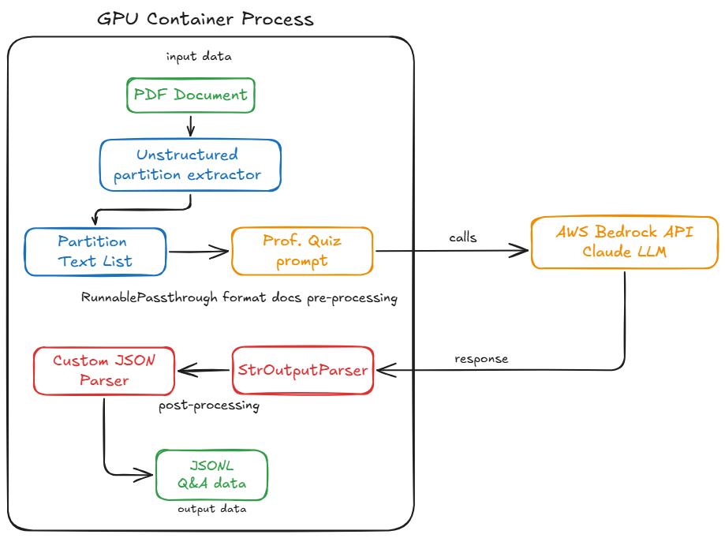
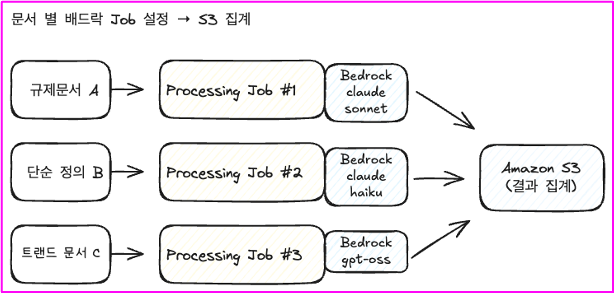

# PDF QA Extraction

[English](README_en.md) | [한국어](README.md)

This tool leverages GPU acceleration to extract text blocks from PDF documents and uses Amazon Bedrock's Claude model to automatically generate high-quality question-answer pairs from the extracted content. Through this process, document knowledge is transformed into structured QA JSON datasets that can be used for training, fine-tuning, or knowledge base construction.

[PDF QA Extraction Process Video Guide](https://assets.fsi.kr/videos/qna-extract.mp4)

## System Flow Diagram



*The above diagram shows the complete process of extracting QA data from PDF documents. When a PDF document is input, it is converted into text blocks through the Unstructured partition extractor, and this data is processed into structured JSONL QA data using the Claude LLM.*

## Installation Guide

### Building Unstructured CUDA Docker Image

Unstructured provides powerful tools for extracting and processing content from PDFs. This tool performs block-level text extraction from documents to convert data into structured format. To set up the Docker environment, follow these steps:

1. Ensure Docker is installed on your system.

2. Build Docker image:
     ```bash
     docker build -t qa-extractor -f Dockerfile .
     ```

     ```bash
     # Event Engine lab accounts have network restrictions and must use this Dockerfile_event_eng.
     docker build -t qa-extractor -f Dockerfile_event_eng .     
     ```

### GPU-based PDF Extractor Usage Guide

#### 1. Running in Local GPU Environment

The Unstructured Extractor uses GPU to quickly extract text from PDF documents. The Docker container supports NVIDIA GPUs and can be run as follows:

```bash
# AWS Bedrock (Linux/macOS)
docker run --rm --gpus all -v $(pwd):/app -w /app --env-file .env qa-extractor python processing_local.py

# AWS Bedrock (Windows)
docker run --rm --gpus all -v %cd%:/app -w /app --env-file .env qa-extractor python processing_local.py

# OpenAI (Linux/macOS)
docker run --rm --gpus all -v $(pwd):/app -w /app --env-file .env qa-extractor python processing_local_openai.py

# OpenAI (Windows)
docker run --rm --gpus all -v %cd%:/app -w /app --env-file .env qa-extractor python processing_local_openai.py
```

To verify GPU support is enabled:
```bash
docker run --rm --gpus all nvidia/cuda:11.6.2-base-ubuntu20.04 nvidia-smi
```

#### Environment Variable Configuration

The following environment variables must be set during execution:

**For AWS Bedrock (`processing_local.py`)**
- `AWS_REGION`: AWS region (e.g., us-east-1)
- `AWS_ACCESS_KEY_ID`: AWS access key
- `AWS_SECRET_ACCESS_KEY`: AWS secret key
- `AWS_SESSION_TOKEN`: AWS session token (optional)
- `PDF_PATH`: Path to the PDF file to process
- `DOMAIN`: Document subject domain (e.g., "International Finance")
- `NUM_QUESTIONS`: Number of questions to generate per text element
- `NUM_IMG_QUESTIONS`: Number of questions to generate per image
- `MODEL_ID`: Bedrock model ID to use (e.g., anthropic.claude-3-sonnet-20240229-v1:0)
- `TABLE_MODEL`: Table structure inference model (e.g., yolox)

**For OpenAI (`processing_local_openai.py`)**
- `OPENAI_API_KEY`: OpenAI API key
- `PDF_PATH`: Path to the PDF file to process
- `DOMAIN`: Document subject domain (e.g., "International Finance")
- `NUM_QUESTIONS`: Number of questions to generate per text element
- `NUM_IMG_QUESTIONS`: Number of questions to generate per image
- `TABLE_MODEL`: Table structure inference model (e.g., yolox)

## Table Extraction Model Comparison

### Detailed Performance Comparison

| Model | Vendor | Accuracy | Speed | GPU Memory | Features |
|-------|--------|----------|-------|------------|----------|
| detectron2 | Meta | ⭐⭐⭐⭐⭐ | ⭐⭐ | High | Highest accuracy, research use |
| detectron2_onnx | Meta | ⭐⭐⭐⭐⭐ | ⭐⭐⭐ | Medium | ONNX optimized version |
| table-transformer | Microsoft | ⭐⭐⭐⭐⭐ | ⭐⭐ | High | Excellent for complex tables, Download issue in SageMaker Processing (2025-09-08) |
| tatr | Community | ⭐⭐⭐⭐ | ⭐⭐⭐ | Medium | Balanced performance |
| yolox | Megvii | ⭐⭐⭐ | ⭐⭐⭐⭐⭐ | Low | Fast processing |
| yolox_quantized | Megvii | ⭐⭐ | ⭐⭐⭐⭐⭐ | Very Low | Ultra-fast processing |
| paddle | Baidu | ⭐⭐⭐ | ⭐⭐⭐ | Medium | Chinese table specialized |
| chipper | Community | ⭐⭐ | ⭐⭐⭐⭐ | Low | Lightweight model |

### Recommended Models by GPU Memory

| GPU Memory | Recommended Model | Features |
|------------|-------------------|----------|
| Under 4GB | yolox_quantized | Ultra-lightweight |
| 4-8GB | yolox | Basic |
| 8-12GB | tatr | Balanced |
| 12-16GB | table-transformer | High performance |
| 16-24GB | detectron2_onnx | Meta optimized |
| 24GB+ | detectron2 | Meta highest performance |

### Recommended Models by Use Case

| Use Case | Recommended Model | Reason |
|----------|-------------------|--------|
| Research paper analysis | detectron2 | Highest accuracy required |
| Reports | table-transformer | Many complex tables |
| General documents | tatr | Balanced choice |
| Real-time processing | yolox_quantized | Speed priority |
| Batch processing | detectron2_onnx | Large-scale processing |
| Chinese documents | paddle | Language specialized |
| IoT Edge | chipper | Lightweight |

```bash
# Create .env file
touch .env

# Open .env file with vi editor
vi .env
```

Press i to enter input mode
Copy and paste the content below:

**For AWS Bedrock:**
```bash
# App Setting
PDF_PATH=data/fsi_data.pdf
DOMAIN=International Finance
NUM_QUESTIONS=5
NUM_IMG_QUESTIONS=1
MODEL_ID=anthropic.claude-3-sonnet-20240229-v1:0
TABLE_MODEL=yolox

# AWS Configuration
AWS_REGION=us-east-1
AWS_ACCESS_KEY_ID=your_access_key_here
AWS_SECRET_ACCESS_KEY=your_secret_key_here
AWS_SESSION_TOKEN=your_session_token_here

# Press ESC and type :wq to save and exit
```

**For OpenAI:**
```bash
# App Setting
PDF_PATH=data/fsi_data.pdf
DOMAIN=International Finance
NUM_QUESTIONS=5
NUM_IMG_QUESTIONS=1
TABLE_MODEL=yolox

# OpenAI Configuration
OPENAI_API_KEY=your_openai_api_key_here

# Press ESC and type :wq to save and exit
```

> **Note**: Use the `.env` file only for local testing purposes. Using IAM roles in production environments is the reference architecture practice. Please be careful not to expose AWS Keys and OpenAI API Keys externally.

#### Performance Optimization Tips

- Large PDF files (over 100MB) should be split before processing
- Running in an environment with CUDA-compatible GPU improves processing speed by 5-10 times
- Monitor memory usage and adjust the `batch_size` parameter if necessary (refer to partition_pdf in the code)

#### 2. Running on SageMaker Processing Job

The Unstructured-qa-extractor image can be run as a batch job through Amazon SageMaker Processing Jobs:

1. Push image to ECR:
    The following commands in the terminal perform ECR authentication, image tagging, repository creation, and image push processes respectively. They register the locally built Docker image to AWS ECR so it can be used in SageMaker.
     ```bash
     # ECR login - Perform AWS authentication
     aws ecr get-login-password --region <your-region> | docker login --username AWS --password-stdin <your-account-id>.dkr.ecr.<your-region>.amazonaws.com
     # Tag local image for ECR
     docker tag qa-extractor <your-account-id>.dkr.ecr.<your-region>.amazonaws.com/qa-extractor
     # Create ECR repository
     aws ecr create-repository --repository-name qa-extractor --region <your-region>
     # Push image to ECR
     docker push <your-account-id>.dkr.ecr.<your-region>.amazonaws.com/qa-extractor
     ```

2. Create SageMaker Processing Job:

     SageMaker Processing Job is a feature of AWS SageMaker for handling various stages of ML workflows such as data preprocessing, postprocessing, and model evaluation.
     For detailed examples on creating Unstructured Q&A Processing Jobs, refer to the `sagemaker_processingjob_pdf_qa_extraction.ipynb` notebook.
     
          ```python
          from sagemaker.processing import ProcessingInput, ProcessingOutput, Processor

          # Create processor object
          processor = Processor(
              role='your-iam-role',
              image_uri='your-container-image',
              instance_count=1,
              instance_type='ml.g5.xlarge',
              volume_size_in_gb=30
          )

          # Run processing job
          processor.run(
              inputs=[
                  ProcessingInput(
                      source='s3://your-bucket/input-data',
                      destination='/opt/ml/processing/input'
                  )
              ],
              outputs=[
                  ProcessingOutput(
                      source='/opt/ml/processing/output',
                      destination='s3://your-bucket/output-data'
                  )
              ],
              code='path/to/your/processing_script.py'
          )
          ```
          
          **Processing Job Configuration Explanation:**
          - `role`: IAM role ARN for SageMaker to access AWS resources
          - `image_uri`: qa-extractor container image URI uploaded to ECR
          - `instance_count`: Number of instances to run (increase for parallel processing)
          - `instance_type`: GPU instance type to use for processing job
          - `volume_size_in_gb`: EBS storage volume size allocated for processing job
          - `inputs`: Specify data path to import from S3 bucket to container (/opt/ml/processing/ is default)
          - `outputs`: Specify S3 path to store processing results (/opt/ml/processing/ is default)
          - `code`: Path to processing script to run inside container

This approach allows efficient management and scaling of large-scale PDF processing tasks.

### Advantages of Parallel Processing with SageMaker

SageMaker Processing Jobs enable parallel processing by running multiple independent jobs simultaneously, each handling different document ranges or types with flexible LLM provider selection.



*The diagram above illustrates how multiple SageMaker Processing Jobs can run in parallel, each processing different document sets with different LLM providers simultaneously.*

#### Key Benefits:

**1. Multiple Job Parallel Execution**
- Launch multiple independent Processing Jobs simultaneously, each with `instance_count=1`
- Each job processes a specific document range, type, or category
- **Large Document Sets**: Even for the same document type, split large collections into multiple jobs for parallel processing
  - Example: 1,000 financial reports can be split into 10 jobs processing 100 documents each
  - Reduces processing time from 10 hours (sequential) to 1 hour (10 parallel jobs)
- Dramatically reduce total processing time for large document collections
- Jobs run independently without interfering with each other

**2. Flexible Job Configuration per Document Type**
- Assign different LLM providers to different jobs based on document characteristics
- Example:
  - Job 1: Financial reports → AWS Bedrock Claude (domain expertise)
  - Job 2: Technical papers → OpenAI GPT-4 (technical understanding)
  - Job 3: Legal documents → AWS Bedrock Claude with specialized prompts
- Optimize cost and quality by matching the right LLM to each document type

**3. Scalability & Cost Optimization**
- Scale horizontally by launching more jobs, not by increasing instance count per job
- Process hundreds of documents in parallel across multiple jobs
- Pay only for the compute time used during processing
- Auto-shutdown after each job completion prevents idle resource costs

**4. Fault Tolerance & Reliability**
- Failed jobs can be easily retried without affecting other running jobs
- Independent job execution ensures one document set failure doesn't impact others
- Complete audit trail and logging for all processing activities
- Easy to identify and reprocess specific document ranges if needed

#### Parallel Processing Example:

```python
from sagemaker.processing import Processor, ProcessingInput, ProcessingOutput
import time

# Define different job configurations
jobs_config = [
    # Case 1: Different document types with different LLMs
    {
        'name': 'financial-docs-bedrock',
        'input': 's3://bucket/financial-reports/',
        'output': 's3://bucket/qa-results/financial/',
        'llm_provider': 'bedrock',
        'model_id': 'anthropic.claude-3-sonnet-20240229-v1:0'
    },
    {
        'name': 'technical-docs-openai',
        'input': 's3://bucket/technical-papers/',
        'output': 's3://bucket/qa-results/technical/',
        'llm_provider': 'openai',
        'model': 'gpt-4o'
    },
    {
        'name': 'legal-docs-bedrock',
        'input': 's3://bucket/legal-documents/',
        'output': 's3://bucket/qa-results/legal/',
        'llm_provider': 'bedrock',
        'model_id': 'anthropic.claude-3-sonnet-20240229-v1:0'
    },
    # Case 2: Same document type, split by document range (large volume)
    {
        'name': 'financial-reports-batch-1',
        'input': 's3://bucket/financial-reports/batch-001-100/',  # Documents 1-100
        'output': 's3://bucket/qa-results/financial-batch-1/',
        'llm_provider': 'bedrock',
        'model_id': 'anthropic.claude-3-sonnet-20240229-v1:0'
    },
    {
        'name': 'financial-reports-batch-2',
        'input': 's3://bucket/financial-reports/batch-101-200/',  # Documents 101-200
        'output': 's3://bucket/qa-results/financial-batch-2/',
        'llm_provider': 'bedrock',
        'model_id': 'anthropic.claude-3-sonnet-20240229-v1:0'
    },
    {
        'name': 'financial-reports-batch-3',
        'input': 's3://bucket/financial-reports/batch-201-300/',  # Documents 201-300
        'output': 's3://bucket/qa-results/financial-batch-3/',
        'llm_provider': 'bedrock',
        'model_id': 'anthropic.claude-3-sonnet-20240229-v1:0'
    }
]

# Launch all jobs in parallel
for config in jobs_config:
    processor = Processor(
        role='your-iam-role',
        image_uri=f'your-qa-extractor-{config["llm_provider"]}-image',
        instance_count=1,  # Each job uses only 1 instance
        instance_type='ml.g5.xlarge',
        volume_size_in_gb=30
    )

    # Run job asynchronously (non-blocking)
    processor.run(
        job_name=f'qa-extraction-{config["name"]}-{int(time.time())}',
        inputs=[
            ProcessingInput(
                source=config['input'],
                destination='/opt/ml/processing/input'
            )
        ],
        outputs=[
            ProcessingOutput(
                source='/opt/ml/processing/output',
                destination=config['output']
            )
        ],
        wait=False  # Don't wait for job completion, launch next job immediately
    )

print(f"Launched {len(jobs_config)} parallel processing jobs successfully!")
```

**Performance Comparison:**

*Example 1: Different Document Types*
- **Sequential Processing**: 3 document types × 30 min/type = 90 minutes
- **Parallel Processing**: max(30 min, 30 min, 30 min) = 30 minutes
- **Speed Improvement**: 3x faster

*Example 2: Large Volume Same Document Type (300 financial reports)*
- **Sequential Processing**: 300 documents × 2 min/doc = 600 minutes (10 hours)
- **Parallel Processing (3 jobs)**: 100 documents × 2 min/doc = 200 minutes (3.3 hours)
- **Speed Improvement**: 3x faster
- **Parallel Processing (10 jobs)**: 30 documents × 2 min/doc = 60 minutes (1 hour)
- **Speed Improvement**: 10x faster

**Cost Comparison:**
- Total compute time is the same (instance-minutes remain constant)
- Wall-clock time dramatically reduced (better time-to-insight)
- Ability to use spot instances for additional 70% cost savings
- No idle time between batches, maximizing resource utilization

This parallel job execution capability makes SageMaker Processing ideal for enterprise-scale document processing workflows where different document types require different handling strategies and LLM providers.

## Usage

This directory contains scripts for:
- PDF text extraction
- Content processing
- Question-answer pair generation

Please refer to individual script documentation for detailed usage of each tool.

## Dependencies

- Python 3.8+
- Unstructured GPU TEXT Extractor Image 
- SageMaker Processing Job